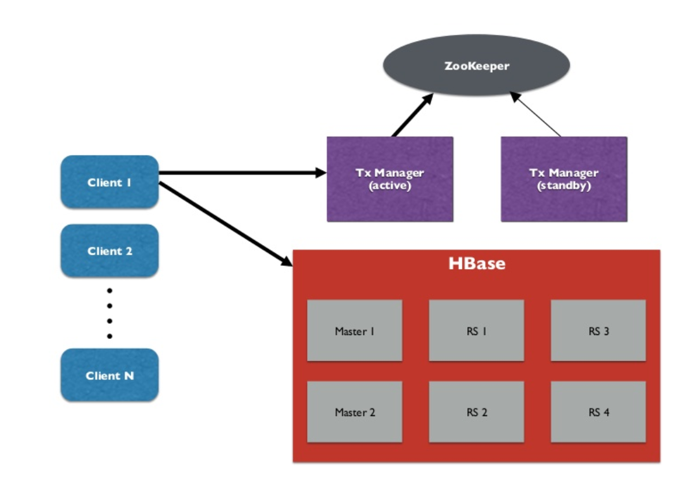
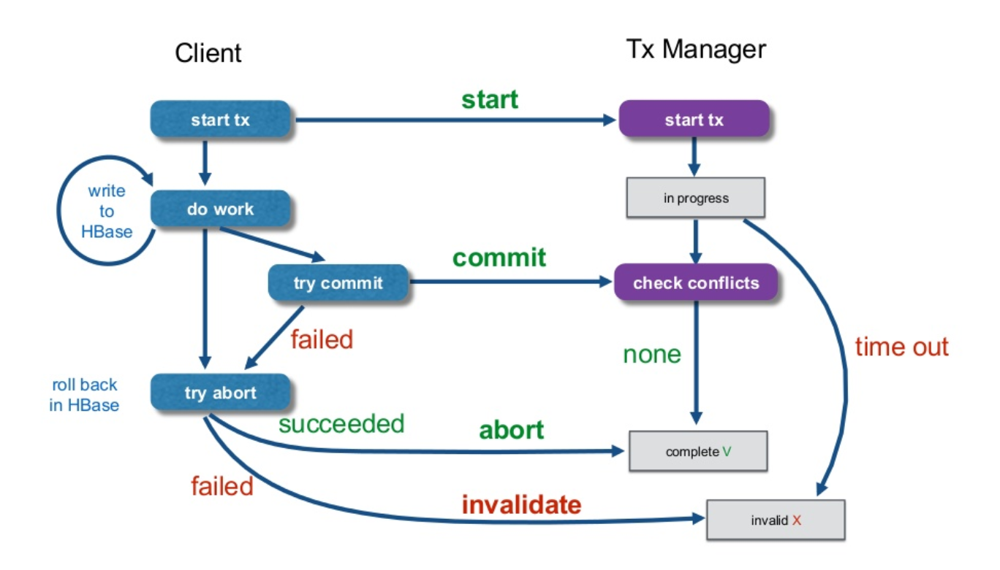
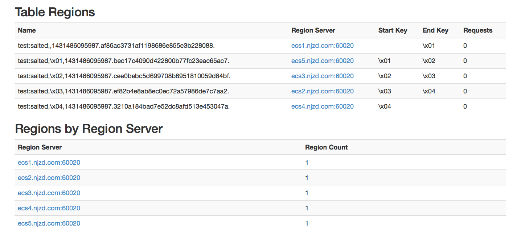
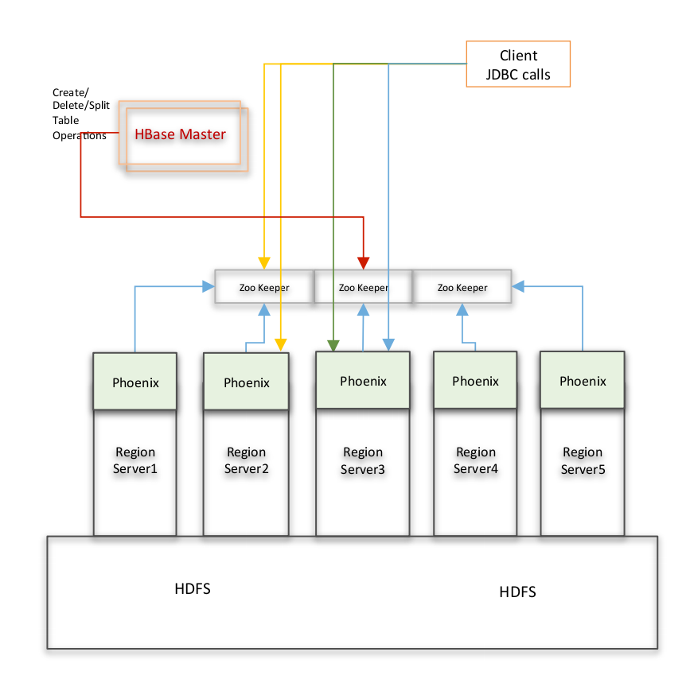
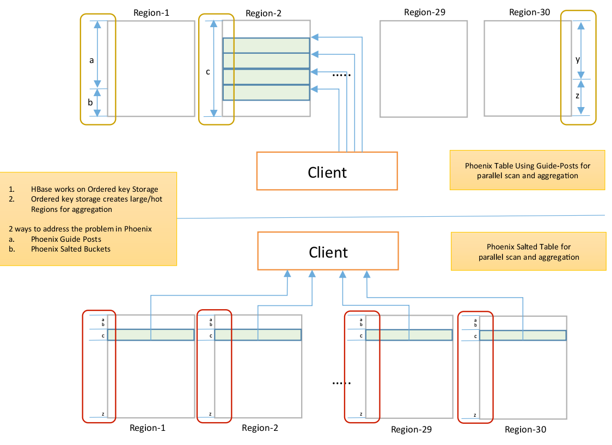
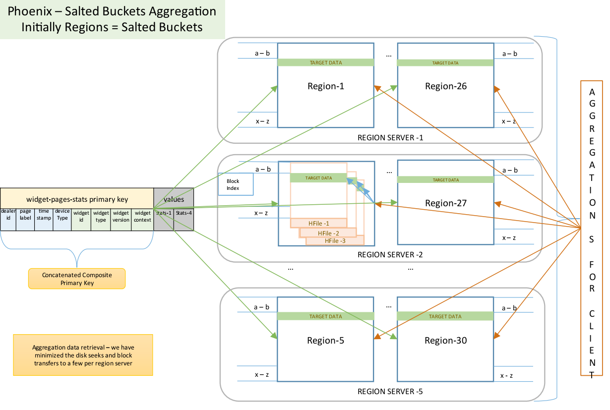
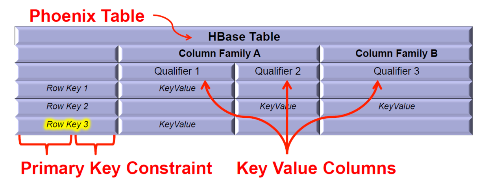
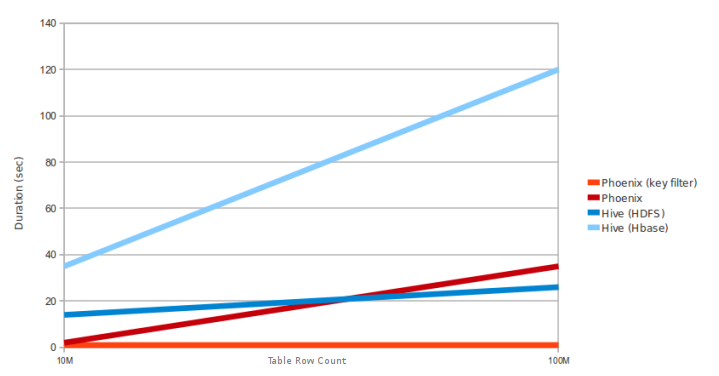
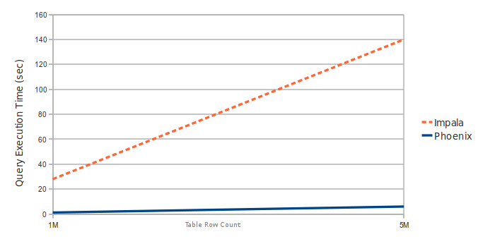

# phoenix

## Phoenix定义

Phoenix最由saleforce开源，后给贡献给Apache基金会的项目，现在是Apache基金的顶级项目，最新版本是4.10.0。Apache Phoenix在hadoop基础上的构建低延时应用可以做到在OLTP与决策分析上做到完美结合：

- 标准SQL与JDBC API，并拥有完整的ACID事务能力
- 通过构建在Hbase之上，为NOSQL带来灵活的late-bound，schema-on-read能力

Phoenix完全使用Java编写，作为HBase内嵌的JDBC驱动。Phoenix查询引擎会将SQL查询转换为一个或多个HBase扫描，并编排执行以生成标准的JDBC结果集。直接使用HBase API、协同处理器与自定义过滤器，对于简单查询来说，其性能量级是毫秒，对于百万级别的行数来说，其性能量级是秒。

Apache Phoenix可以与其他的Hadoop产品，如Spark、Hive、Pig、Flume、MapReduce进行深度集成。

Phoenix通过以下方式使我们可以少写代码，并且性能比我们自己写代码更好：

- 将SQL编译成原生的HBase scans。
- 确定scan关键字的最佳开始和结束
- 让scan并行执行
- ...

使用Phoenix的公司


## Phoenix特性

Phoenix4.10.0版本的主要特性包括：事务、UDF函数、二级索引、存储优化、原子级的Upsert、命名空间映射、统计信息收集、Row timestamp、分页查询、Salted Tables、Skip Scan、视图、多租户、动态列、批量数据加载、追踪、指标等。

### 事务

在Hbase行级和区级上支持事务，Phoenix实现更多的事务是通过集成Tephra。Tephra也是Apache的一个孵化项目项目,是事务管理器，它在像HBase这样的分布式数据存储上提供全局一致事务。Tephra通过实现多版本并发性控制提供并发性事务快照方案，额外提供交叉行、交叉表的一致性来支持可扩展性，从而使Phoenix支持完整的ACID语义。





> 通过一些配置，Phoenix已经支持了事务特性，但创建表的时候默认还是不支持的。如果想创建一个表支持事务特性，需要显示声明，如下：
>
> ```
> CREATE TABLE my_table (k BIGINT PRIMARY KEY, v VARCHAR) TRANSACTIONAL=true;
> ```
>
> 就是在建表语句末尾增加 TRANSACTIONAL=true。原本存在的表也可以更改成支持事务的，需要注意的是，事务表无法改回非事务的，因此更改的时候要小心。一旦改成事务的，就改不回去了。
>
> ```
> ALTER TABLE my_other_table SET TRANSACTIONAL=true;
> ```

### User-defined functions(UDF函数)

从Phoenix 4.4.0版本起，Phoenix开始支持用户自定义函数。

用户可以创建临时或永久的用户自定义函数。这些用户自定义函数可以像内置的create、upsert、delete一样被调用。临时函数是针对特定的会话或连接，对其他会话或连接不可见。永久函数的元信息会被存储在一张叫做SYSTEM.FUNCTION的系统表中，对任何会话或连接均可见。UDF还支持多租户，对于特定的租户而言，它创建的UDF对其他租户不可见，只有全局UDF对所有租户可见。利用HBase的动态类加载器加载HDFS上的UDF jar到Phoenix客户端和region server，不需要额外重启服务。

> **限制**
>
> - UDF需要的jar需要手动从HDFS添加或删除，同时还需要显示的利用sql语句进行添加或删除的声明。[PHOENIX-1890](https://issues.apache.org/jira/browse/PHOENIX-1890)
> - 动态类加载器在查询时会将jar复制到 {hbase.local.dir}/jars目录下，而删除函数时则需要手动去删除。
> - 函数索引需要手动重建，一旦函数实现发生变化。[PHOENIX-1907](https://issues.apache.org/jira/browse/PHOENIX-1907)
> - 一旦加载，jar不能unload，所以需要将修改实现另外命名的打包jar替换，防止集群加载的还是老jar。[PHOENIX-1907](https://issues.apache.org/jira/browse/PHOENIX-1907)
> - 需要函数列表时需要查询SYSTEM.“FUNCTION”表 [PHOENIX-1921](https://issues.apache.org/jira/browse/PHOENIX-1921)

### Secondary Indexing

在HBase中，只有一个单一的按照字典序排序的rowKey索引，当使用rowKey来进行数据查询的时候速度较快，但是如果不使用rowKey来查询的话就需要利用filter来对全表进行扫描，很大程度上降低了检索性能。而Phoenix提供了二级索引技术来应对这种使用rowKey之外的条件进行检索的场景。

Phoenix提供以下几种索引：

- Covered Indexes

只需要通过索引就能返回所要查询的数据，所以索引的列必须包含所需查询的列(SELECT的列和WHRER的列)

- Functional Indexes

从Phoeinx4.3以上就支持函数索引，其索引不局限于列，可以合适任意的表达式来创建索引，当在查询时用到了这些表达式时就直接返回表达式结果

- Global Indexes

Global indexing适用于多读少写的业务场景。

使用Global indexing的话在写数据的时候会消耗大量开销，因为所有对数据表的更新操作（DELETE, UPSERT VALUES and UPSERT SELECT）,会引起索引表的更新，而索引表是分布在不同的数据节点上的，跨节点的数据传输带来了较大的性能消耗。在读数据的时候Phoenix会选择索引表来降低查询消耗的时间。在默认情况下如果想查询的字段不是索引字段的话索引表不会被使用，也就是说不会带来查询速度的提升。

- Local Indexes

Local indexing适用于写操作频繁的场景。

与Global indexing一样，Phoenix会自动判定在进行查询的时候是否使用索引。使用Local indexing时，索引数据和数据表的数据是存放在相同的服务器中的避免了在写操作的时候往不同服务器的索引表中写索引带来的额外开销。使用Local indexing的时候即使查询的字段不是索引字段索引表也会被使用，这会带来查询速度的提升，这点跟Global indexing不同。一个数据表的所有索引数据都存储在一个单一的独立的可共享的表中。

### Storage Formats

4.10.0版本起，Phoenix可以减少磁盘存储空间，以提高整体性能，主要通过下面两个部分：

- 增加了一个中间层，用以将Phoeinx列名与HBase column qualifiers相对应

  > 只有在创建表时，才能设置列映射属性。在决定使用列映射之前，您需要考虑在其生命周期中的表和它的视图层次结构中期望有多少列。对于各种映射方案，下面是列数的限制：
  >
  > | Config/Property Value | Max # of columns |
  > | --------------------- | ---------------- |
  > | 1                     | 255              |
  > | 2                     | 65535            |
  > | 3                     | 16777215         |
  > | 4                     | 2147483647       |
  > | None                  | no limited(理论上)  |
  >
  > 对于可变表，此限制适用于所有列族中的列。对于不可变表，该限制适用于每个列族。默认情况下，任何新的Phoeinx表都可以使用列映射功能。这些设置可以通过设置以下配置在hbase-site.xml期望值重写。
  >
  > | Table type        | Default Column mapping | Config                                   |
  > | ----------------- | ---------------------- | ---------------------------------------- |
  > | Mutable/Immutable | 2 byte qualifiers      | phoenix.default.column.encoded.bytes.attrib |
  >
  > 此配置控制全局级别的默认值，将适用于所有表。如果你想使用跟全局的映射不同的方案，那么你可以使用column_encoded_bytes表属性。
  >
  > ```
  > CREATE TABLE T
  > (    
  > a_string varchar not null,  
  > col1 integer  
  > CONSTRAINT pk PRIMARY KEY (a_string)  
  > )  
  > COLUMN_ENCODED_BYTES = 1;
  > ```

- 支持一种新的编码格式，用在不可变表（immutable table）中，可以将所有值存储在每个列族的单个单元格中。

  > 像列映射一样，只有在创建表时才能设置不可变数据编码。通过性能测试，可以发现，使用single_cell_array_with_offsets一般都提供很好的性能改善并节省空间。下面是一些场景时，最好使用one_cell_per_column编码代替。
  >
  > - 数据稀疏，即小于50%的列有值
  > - 列族中数据的大小变得太大。一般情况下，默认的HBase 64K块大小，如果在一个列族的数据增长超过50k，我们就不应该使用single_cell_array_with_offsets。
  > - 对于有视图的不可变表

  默认情况下，非多租户不可变表在创建表时使用两个字节的列映射和single_cell_array_with_offsets数据编码。另一方面，多租户的不可变表创建两个字节的列映射方案和one_column_per_cell数据编码。这是因为多租户表更适合one_cell_per_column编码。与列映射一样，如果你想改变这些全局默认值，你可以通过设置在hbase-site.xml配置。

  | Immutable Table type | Immutable storage scheme       | Config                                   |
  | -------------------- | ------------------------------ | ---------------------------------------- |
  | Multi-tenant         | ONE_CELL_PER_COLUMN            | phoenix.default.multitenant.immutable.storage.scheme |
  | Non multi-tenant     | SINGLE_CELL_ARRAY_WITH_OFFSETS | phoenix.default.immutable.storage.scheme |

### Atomic Upsert

为支持atomic upsert，可选的ON DUPLICATE KEY语法（类似于MySQL语法），自Phoenix4.9开始加入到UPSERT VALUES命令中。这个特性为Hbase的自增和CheckAndPut函数提供了一个支持atomic upsert的扩展。在服务端，当提交处理时，将在更新当前列值和执行重复键子句时锁定正在更新的行，鉴于该行必须锁定和读取时当使用ON DUPLICATE KEY，会有性能损失（就像HBase上直接使用Put和使用CheckAndPut时一样）。

当使用ON DUPLICATE KEY时，如果行已经存在，值可能是忽略或被替换：

- 如果指定ON DUPLICATE KEY IGNORE，则值会被忽略

- 如果指定ON DUPLICATE KEY UPDATE，则值会被更新

  >  如果在INSERT语句末尾指定了ON DUPLICATE KEY UPDATE，并且插入行后会导致在一个UNIQUE索引或PRIMARY KEY中出现重复值，则在出现重复值的行执行UPDATE；如果不会导致唯一值列重复的问题，则插入新行

#### 例子

ON DUPLICATE KEY UPDATE用于两行计数

```
UPSERT INTO my_table(id, counter1, counter2) VALUES ('abc', 0, 0)
ON DUPLICATE KEY UPDATE counter1 = counter1 + 1, counter2 = counter2 + 1;
```

DUPLICATE KEY IGNORE用于插入，如果值不存在，存在跳过

```
UPSERT INTO my_table(id, my_col) VALUES ('abc', 100)
ON DUPLICATE KEY IGNORE;
```

注意，此处可以使用复杂的表达式，例如

```
UPSERT INTO my_table(id, total_deal_size, deal_size) VALUES ('abc', 0, 100)
ON DUPLICATE KEY UPDATE
    total_deal_size = total_deal_size + deal_size,
    approval_reqd = CASE WHEN total_deal_size < 100 THEN 'NONE'
    WHEN total_deal_size < 1000 THEN 'MANAGER APPROVAL'
    ELSE 'VP APPROVAL' END;
```

#### 限制

- 主键列无法更新，因为这等同于创建新行
- 事务表不能使用 atomic upserts，因为它已经在发生冲突时定义了异常处理
- 不可变表不能使用 atomic upserts，因为定义中不能对现有行进行更新
- 在连接时不能设置CURRENT_SCN，由于HBase在最终值被更新之前不能保证原子性
- 同一列在同一语句中只能更新一次
- 子句中不可以包含聚合或引用序列
- 不推荐对列的全局索引使用。

### Namespace Mapping

从4.8.0版本开始，用户可以将schema映射到namespace上，以便任何包含schema的表都可以创建在HBase的Namespace上。早期版本，所有的表（无论是否包含schema）都创建于默认的namespace。

####  配置

| **Property**                             | **Description**                          | **Default ** |
| ---------------------------------------- | ---------------------------------------- | ------------ |
| phoenix.schema.isNamespaceMappingEnabled | 如果启用，包含schema的表创建后将映射到namespace。这项需要在客户端和服务端同时设置。一旦设置后，不能回退，同时设置之前的客户端将不能在工作。 | false        |
| phoenix.schema.mapSystemTablesToNamespace | 当phoenix.connection.isNamespaceMappingEnabled设置成true时，此项才有效。如果启用，SYSTEM表将自动迁移到SYSTEM namespace。如果设置为false ，system表只能创建在default namespace。这项需要在客户端和服务端同时设置。 | true         |

#### 语法

- CREATE SCHEMA

  ```sql
  CREATE SCHEMA IF NOT EXISTS my_schema
  CREATE SCHEMA my_schema
  ```

- USE SCHEMA

  ```sql
  USE my_schema
  USE DEFAULT
  ```

- DROP SCHEMA

  ```sql
  DROP SCHEMA IF EXISTS my_schema
  DROP SCHEMA my_schema
  ```

### Statistics Collection 

 UPDATE STATISTICS可以更新某张表的统计信息，以提高查询性能

用法：

- 对于一个指定的表my_table更新统计数据,执行下面的命令，将收集my_table及相关的所有索引表，视图，视图索引表的统计信息

```sql
UPDATE STATISTICS my_table
等同于
UPDATE STATISTICS my_table ALL
```

- 仅统计索引表信息

```sql
UPDATE STATISTICS my_table INDEX
```

- 仅统计表信息

```sql
UPDATE STATISTICS my_table COLUMNS
```

- 修改表的指标宽度限制在10m

```sql
ALTER TABLE my_table SET GUIDE_POSTS_WIDTH = 10000000
```

- 删除表的指标宽度

```sql
ALTER TABLE my_table SET GUIDE_POSTS_WIDTH = null
```

### Row timestamp

从4.6版本开始，Phoenix提供了一种将HBase原生的row timestamp映射到Phoenix列的方法。这样有利于充分利用HBase提供的针对存储文件的时间范围的各种优化，以及Phoenix内置的各种查询优化。

一列被指定为row_timestamp，需要遵循一定的约束：

- 只有主键列类型是TIME, DATE, TIMESTAMP, BIGINT, UNSIGNED_LONG可以被指定为row_timestamp。
- 可以被指定为row_timestamp主键列只能是一个。
- 该列的值不能为空值（因为它是直接映射到HBase行时间戳）。这也意味着只有在创建表时一列可以被声明为row_timestamp。
- 一个row_timestamp列的值不能为null。时间/日期/时间戳，在相应的时间在毫秒级要大于等于零。

当使用UPSERT VALUES 或者 UPSERT SELECT更新插入一个带有row_timestamp的表时，需要显式为row timestamp column设置值或由Phoenix自动设置。未指定时，Phoenix将时间戳列的值设置为服务器侧时间。该列的值HBase的时间戳相同。

例子

```sql
CREATE TABLE DESTINATION_METRICS_TABLE
(CREATED_DATE DATE NOT NULL,
METRIC_ID CHAR(15) NOT NULL,
METRIC_VALUE LONG
CONSTRAINT PK PRIMARY KEY(CREATED_DATE ROW_TIMESTAMP, METRIC_ID))
SALT_BUCKETS = 8; 
```

UPSERT INTO DESTINATION_METRICS_TABLE VALUES (?, ?, ?) 

> 将显式设置CREATED_DATE的值

UPSERT INTO DESTINATION_METRICS_TABLE (METRIC_ID, METRIC_VALUE) VALUES (?, ?)

> 将使用服务端的时间戳设置CREATED_DATE的值

UPSERT INTO DESTINATION_METRICS_TABLE (CREATED_DATE, METRICS_ID, METRIC_VALUE) SELECT DATE, METRICS_ID,METRIC_VALUE FROM SOURCE_METRICS_TABLE

> 将SOURCE_METRICS_TABLE的date值设置到CREATED_DATE中

UPSERT INTO DESTINATION_METRICS_TABLE (METRICS_ID, METRIC_VALUE) SELECT METRICS_ID, METRIC_VALUE FROM SOURCE_METRICS_TABLE

> 将服务器时间设置到目标表的CREATED_DATE中

### Paged Queries

Phoenix支持分页查询：

- Row Value Constructors (RVC) 类似于MySQL [WL#7019](https://dev.mysql.com/worklog/task/?id=7019)

- OFFSET with limit

  例

  ```sql
  SELECT title, author, isbn, description
  FROM library
  WHERE published_date > 2010
  ORDER BY title, author, isbn
  LIMIT 10 OFFSET 10
  ```

### Salted Tables

为了避免读写HBase表数据时产生hot-spot问题，我们使用Phoenix来创建表时可以采用salted table。salted table可以自动在每一个rowkey前面加上一个字节，这样对于一段连续的rowkeys，它们在表中实际存储时，就被自动地分布到不同的region中去了。当指定要读写该段区间内的数据时，也就避免了读写操作都集中在同一个region上。简而言之，如果我们用Phoenix创建了一个salted table，那么向该表中写入数据时，原始的rowkey的前面会被自动地加上一个byte（不同的rowkey会被分配不同的byte），使得连续的rowkeys也能被均匀地分布到多个regions。

- 创建salted table

```sql
CREATE TABLE "test:salted"(pk VARCHAR PRIMARY KEY, c1 VARCHAR, c2 VARCHAR, c3 VARCHAR) SALT_BUCKETS=5;
```

上述语句创建了一个名为”test:salted”的table（HBase中事先要创建名为test的namespace），`SALT_BUCKETS=5` 说明该salted table由5个bucket组成（必须在1~256之间）。

现在，我们从HBase的UI中观察表”test:salted”，可以发现它确实是由5个bucket构成的：



**Phoenix primary key 与HBase rowkey 的关系**

在创建phoenix table时，必须指定一个primary key，但是这个主键我们不一定用到。如果我们想在用Phoenix创建table时，让Phoniex的主键自动地与HBase的rowkey对应起来，则可以用以下方式来创建：

```sql
create table "{空间名:表名}" ("pk" varchar primary key, "{列1}" varchar, "{列2}" varchar, "{列3}" varchar) salt_buckets=10;
```

这样，Phoniex的主键就自动地与HBase的rowkey对应起来了。

- 写入数据

  > 1. 创建salted table后，应该使用Phoenix SQL来读写数据，而不要混用Phoenix SQL和HBase API 
  > 2. 如果通过Phoenix创建了一个salted table，那么只有通过Phoenix SQL插入数据才能使得被插入的原始rowkey前面被自动加上一个byte，通过HBase shell插入数据无法prefix原始的rowkey 

- 注意点

  1. 顺序扫描

     由于salted table不会顺序存储数据，严格的顺序扫描不会返回所有的数据的自然排序。子句，当前将强制顺序扫描，例如，带有限制的子句，可能返回与正常表不同的项。带有限制的子句，可能返回与正常表不同的结果。

  2. Splitting

     如果没有为salted table指定split points，则salted table将在salt bytes边界上预切分，以确保即使在初始阶段的region server之间的负载分配。如果用户是手动提供split points，用户需要包括一个salt bytes在他们提供的split points上。

  3. Row Key Ordering

     Pre-spliting还要确保所有region server上的入口都从同一salt byte开始，以有序的方式储存。当在所有region server上执行并行扫描时，我们可以利用此属性来执行客户端的合并排序。由此产生的扫描仍将按顺序返回，好像它是从一个正常的表。
     这rowkey顺序扫描可以通过设置phoenix.query.rowkeyordersaltedtable配置在hbase-sites.xml上。设置后，我们不允许用户在salted table上指定的split points，确保每一bucket 将只包含相同的salt byte。当此属性打开，salt byte会表现得就像一个正常的表，按rowkey排序返回扫描。

  4. 性能

     使用带Pre-spliting的salted table，可以在所有region server上均匀地分配，从而提高写入性能。性能评估表明，salted table比非salted table可以提高80%的写入吞吐量。读取数据使用salted table也可以获得好处。

### Skip Scan

可以在范围扫描的时候提高性能。SKIP SCAN意味着要么表的部分子集，要么扫描表的所有记录，然而它将根据过滤条件跳过大量的记录。在一些情况下，当你的leading primary key columns的基数比较低时，它往往比FULL SCAN更有效率。

### views

标准的SQL视图语法现在在Phoenix上也支持了。这使得能在同一张底层HBase物理表上创建多个虚拟表。

**限制**

1. 一个视图的索引只能通过视图创建更新，通过基础表和父视图更新将不在索引上有效果。 ([PHOENIX-1499](https://issues.apache.org/jira/browse/PHOENIX-1499)).
2. 一个主键不能增加到视图上如果主键约束在可变长度列上([PHOENIX-2157](https://issues.apache.org/jira/browse/PHOENIX-2157)).
3. 视图只能定义在基表简单的 SELECT *查询。不能创建视图在多表，无论是join还是聚合 ([PHOENIX-1505](https://issues.apache.org/jira/browse/PHOENIX-1505), [PHOENIX-1506](https://issues.apache.org/jira/browse/PHOENIX-1506)).
4. 一个列增加到视图，不会自动的增加到子视图([PHOENIX-2054](https://issues.apache.org/jira/browse/PHOENIX-2054)). 子视图需要手动添加。
5. 当前只支持CREATE VIEW v AS SELECT * FROM t的全表select语法，将在后续版本支持任意的select字段子句 ([PHOENIX-1507](https://issues.apache.org/jira/browse/PHOENIX-1507)).

### 多租户

通过指定不同的租户连接实现数据访问的隔离

- 多租户在phoenix中通过组合多租户表和多租户连接实现

- 租户打开它的连接后只能访问属于该租户下的数据

  多租户连接示例

  ```java
  Properties props = new Properties();
  props.setProperty("TenantId", "Acme");
  Connection conn = DriverManager.getConnection("localhost", props);
  ```


- 租户可以看见多租户表下属于自己的数据及常规表中的所有数据

  **多租户表** 

  ```sql
  CREATE TABLE base.event (tenant_id VARCHAR, event_type CHAR(1), created_date DATE, event_id BIGINT)
  MULTI_TENANT=true;
  ```

- 为了添加自己的列,租户在与租户相关多租户表基础上创建视图的并将自己的列添加到视图。

  多租户视图

  ```sql
  CREATE VIEW acme.login_event(acme_user_id CHAR(15)) AS
  SELECT * FROM base.event
  WHERE event_type='L';
  ```

### 动态列

例子

```sql
SELECT eventTime, lastGCTime, usedMemory, maxMemory
FROM EventLog(lastGCTime TIME, usedMemory BIGINT, maxMemory BIGINT)
WHERE eventType = 'OOM' AND lastGCTime < eventTime - 1
```

lastGCTime, usedMemory, maxMemory不是表中所有数据都需要有的列。

初始创建表时

```sql
CREATE TABLE EventLog (
    eventId BIGINT NOT NULL,
    eventTime TIME NOT NULL,
    eventType CHAR(3) 
    CONSTRAINT pk PRIMARY KEY (eventId, eventTime))
```

可以使用upsert为该表增加动态列

```sql
UPSERT INTO EventLog (eventId, eventTime, eventType, lastGCTime TIME, usedMemory BIGINT, maxMemory BIGINT) VALUES(1, CURRENT_TIME(), ‘abc’, CURRENT_TIME(), 512, 1024);
```

### Bulk Data Loading

1. 通过psql命令以单线程的方式加载csv，数据量少的情况下适用。 

   ```shell
   bin/psql.py -t EXAMPLE localhost data.csv
   ```

2. 基于MapReduce的bulk load工具，适用于数据量大的情况，支持csv和json

   csv

   ```shell
   hadoop jar phoenix-<version>-client.jar org.apache.phoenix.mapreduce.CsvBulkLoadTool --table EXAMPLE --input /data/example.csv
   ```

   json

   ```shell
   hadoop jar phoenix-<version>-client.jar org.apache.phoenix.mapreduce.JsonBulkLoadTool --table EXAMPLE --input /data/example.json
   ```

### Query Server

Phoenix查询服务器提供与Phoenix和HBase的互动的一种方式。很快这将允许从JVM以外的环境访问。 当前版本还需要在JVM环境下。

Phoenix4.4引入的一个单独的服务器来提供thin客户端的连接，它是基于Apache Calcite的。

**server端**

```shell
bin/queryserver.py [start|stop]
```

**client端**

phoenix-<version>-thin-client.jar或者命令行下使用bin/sqlline-thin.py。

jdbc连接

```
jdbc:phoenix:thin:url=<scheme>://<server-hostname>:<port>[...]
```

命令行下

```shell
bin/sqlline-thin.py [[scheme://]host[:port]] [sql_file]
```

### Tracing

从4.1版本开始Phoenix增加这个特性来追踪每条查询的踪迹，这使用户能够看到每一条查询或插入操作背后从客户端到HBase端执行的每一步。

### Metrics

Phoenix提供各种各样的指标使我们能够知道Phoenix客户端在执行不同SQL语句的时候其内部发生了什么。这些指标在客户端JVM中通过两种方式来收集：

- Request level metrics - collected at an individual SQL statement level


- Global metrics - collected at the client JVM level

## Phoenix构架

> 参考[High Performance Clickstream Analytics with Apache HBase/Phoenix](http://phoenix.apache.org/presentations/StrataHadoopWorld.pdf) 



Phoenix	Layer包含两部分：Dynamic Coprocessors和Dynamic Observers	

具体处理过程

Coprocessors – execute aggregation Observers – Various Types – observe to sync data	

Phoenix聚合过程





## 数据存储

Phoenix将HBase的数据模型映射到关系型



## Phoenix语法

| SELECT          | DROP FUNCTION   | DROP INDEX        |
| --------------- | --------------- | ----------------- |
| UPSERT VALUES   | CREATE VIEW     | ALTER INDEX       |
| UPSERT SELECT   | DROP VIEW       | EXPLAIN           |
| DELETE          | CREATE SEQUENCE | UPDATE STATISTICS |
| CREATE TABLE    | DROP SEQUENCE   | CREATE SCHEMA     |
| DROP TABLE      | ALTER           | USE               |
| CREATE FUNCTION | CREATE INDEX    | DROP SCHEMA       |

**关键字**

| Constraint          | Join Type             | Value           |
| ------------------- | :-------------------- | --------------- |
| Options             | Func Argument         | Case            |
| Hint                | Class Name            | Case When       |
| Scan Hint           | Jar Path              | Name            |
| Cache Hint          | Order                 | Quoted Name     |
| Index Hint          | Expression            | Alias           |
| Small Hint          | And Condition         | Null            |
| Seek To Column Hint | Boolean Condition     | Data Type       |
| Join Hint           | Condition             | SQL Data Type   |
| Serial Hint         | RHS Operand           | HBase Data Type |
| Column Def          | Operand               | String          |
| Table Ref           | Summand               | Boolean         |
| Sequence Ref        | Factor                | Numeric         |
| Column Ref          | Term                  | Int             |
| Select Expression   | Array Constructor     | Long            |
| Select Statement    | Sequence              | Decimal         |
| Split Point         | Cast                  | Number          |
| Table Spec          | Row Value Constructor | Comments        |
| Aliased Table Ref   | Bind Parameter        |                 |

**原生函数** 

聚合函数

| AVG   | PERCENTILE_CONT | NTH_VALUE   |
| ----- | --------------- | ----------- |
| COUNT | PERCENTILE_DISC | STDDEV_POP  |
| MAX   | PERCENT_RANK    | STDDEV_SAMP |
| MIN   | FIRST_VALUE     |             |
| SUM   | LAST_VALUE      |             |

字符串函数

| SUBSTR | LPAD           | UPPER   |
| ------ | -------------- | ------- |
| INSTR  | LENGTH         | LOWER   |
| TRIM   | REGEXP_SUBSTR  | REVERSE |
| LTRIM  | REGEXP_REPLACE | TO_CHAR |
| RTRIM  | REGEXP_SPLIT   |         |

时间函数

| TO_DATE      | TIMEZONE_OFFSET | DAYOFMONTH |
| ------------ | --------------- | ---------- |
| TO_TIME      | NOW             | HOUR       |
| TO_TIMESTAMP | YEAR            | MINUTE     |
| CURRENT_TIME | MONTH           | SECOND     |
| CONVERT_TZ   | WEEK            |            |

数值函数

| ROUND | FLOOR | TO_NUMBER |
| ----- | ----- | --------- |
| CEIL  | TRUNC | RAND      |

数组函数

| ARRAY_ELEM   | ARRAY_PREPEND | ARRAY_TO_STRING |
| ------------ | ------------- | --------------- |
| ARRAY_LENGTH | ARRAY_CAT     | ANY             |
| ARRAY_APPEND | ARRAY_FILL    | ALL             |

数学函数

| SIGN | CBRT  | LN   |
| ---- | ----- | ---- |
| ABS  | EXP   | LOG  |
| SQRT | POWER |      |

其他函数

| MD5    | COALESCE     | SET_BIT  |
| ------ | ------------ | -------- |
| INVERT | GET_BIT      | SET_BYTE |
| ENCODE | GET_BYTE     |          |
| DECODE | OCTET_LENGTH |          |

## 数据类型

| INTEGER(-2147483648 to 2147483647)       | UNSIGNED_FLOAT(0 to 3.402823466 E + 38)  | UNSIGNED_DATE      |
| ---------------------------------------- | ---------------------------------------- | ------------------ |
| UNSIGNED_INT(0 to 2147483647)            | DOUBLE (-1.7976931348623158 E + 308 to 1.7976931348623158 E + 308) | UNSIGNED_TIMESTAMP |
| BIGINT(-9223372036854775808 to 9223372036854775807) | UNSIGNED_DOUBLE(0 to  1.7976931348623158 E + 308) | VARCHAR            |
| UNSIGNED_LONG(0 to 9223372036854775807)  | DECIMAL                                  | CHAR               |
| TINYINT (-128 to 127)                    | BOOLEAN                                  | BINARY             |
| UNSIGNED_TINYINT(0 to 127)               | TIME                                     | VARBINARY          |
| SMALLINT(-32768 to 32767)                | DATE                                     | ARRAY              |
| UNSIGNED_SMALLINT(0 to 32767)            | TIMESTAMP                                |                    |
| FLOAT (-3.402823466 E + 38 to 3.402823466 E + 38) | UNSIGNED_TIME                            |                    |

> Phoenix3.0/4.0后增加了ARRAY类型
>
> 创建带有array的表
>
> ```sql
> CREATE TABLE regions (
>     region_name VARCHAR PRIMARY KEY,
>     zips VARCHAR ARRAY[10],
>     CONSTRAINT pk PRIMARY KEY (region_name));
> ```
>
> 或
>
> ```sql
> CREATE TABLE regions (
>     region_name VARCHAR PRIMARY KEY,
>     zips VARCHAR[],
>     CONSTRAINT pk PRIMARY KEY (region_name));
> ```
>
> 插入表
>
> ```sql
> UPSERT INTO regions(region_name,zips)
> VALUES('SF Bay Area',ARRAY['94115','94030','94125']);
> ```
>
> 或通过java代码
>
> ```java
> PreparedStatement stmt = conn.prepareStatement("UPSERT INTO regions VALUES(?,?)");
> stmt.setString(1,"SF Bay Area");
> String[] zips =  new String[] {"94115","94030","94125"};
> Array array = conn.createArrayOf("VARCHAR", zips);
> stmt.setArray(2, array);
> stmt.execute();
> ```
>
> 查询
>
> ```sql
> SELECT zips FROM regions WHERE region_name = 'SF Bay Area';
> ```
>
> 或
>
> ```sql
> SELECT zip[1] FROM regions WHERE region_name = 'SF Bay Area';
> ```
>
> 利用数组中的元素查询
>
> ```sql
> SELECT region_name FROM regions WHERE zip[1] = '94030' OR zip[2] = '94030' OR zip[3] = '94030';
> ```
>
> 动态获取数组长度
>
> ```sql
> SELECT ARRAY_LENGTH(zips) FROM regions;
> ```

## JOINS

join目前支持Indices，Grouped，Derived 、Hash、Sort-Merge等，同时支持子查询。

## Phoenix性能

### 与其他产品对比

**Phoenix与Hive (running over HDFS and HBase)**



条件：

select count(1) from table 查询10M and 100M行。

数据包含5行，4个region servers。（10GHbase内存，6核3.3G Xeon）

**Phoenix与impala(running over HBase)**



条件:

select count(1) from table 查询1M and 5M行。

数据包含3行， 1个Region Server: 1 (虚拟机, HBase 2GB内存, 2 核3.3GHz Xeon)

### 最新性能测试结果

> [测试时间：Thu Jun 01 11:53:23 PDT 2017](http://phoenix-bin.github.io/client/performance/phoenix-20170601115323.htm#AGGREGATION_TABLE)
>
> 查看测试结果可知Phoenix在单表2000000行时基本可保持在1秒以上10秒以下的秒级。
>
> 对于多表等复杂场景没有相关的测试报告。

## 总结

Phoenix4.10.0版本的特性可知，Phoenix的各项功能非常全面，在功能上基本没有什么短板，同时由3.0开始Join等高级特性也开始支持。唯一的问题就是性能问题，还不足以支撑真正的OLTP。从测试报告也可以看出，Phoenix还是以支持200万级别的小数据量为主，对于千万、亿级别，数十甚至上百列的表，性能无法保证，而针对于两表、多表join如果数据量过大，即使是使用主外键关联，响应时间都会是分钟级以上，甚至出现InsufficientMemoryException。


